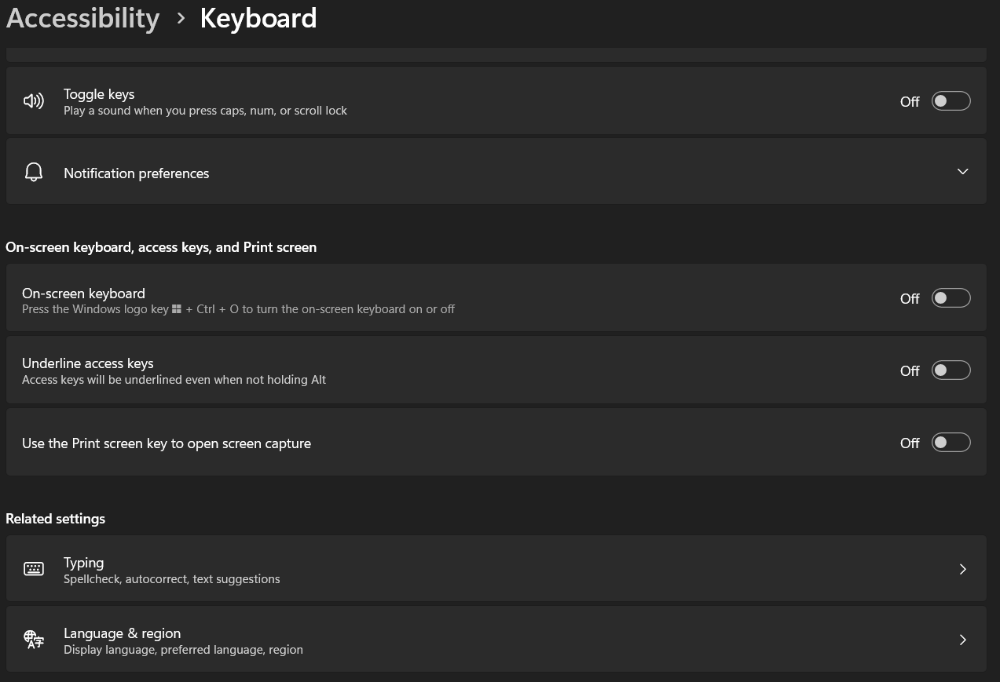

# Windash
## a dashboard for windows to do random stuff, coded in Autohotkey
---
current features:
- quickly set icons for windows folders

## instructions
### prerequisites:

- Autohotkey v2 installed

### Windows 11

1. go to settings > Accessibility > keyboard

2. deselect "Use the print screen key to open screen capture
3. in github, select "Code <>" > download as zip
4. extract the zip file
5. run WINDASH.ahk

pressing Prt sc on your keyboard should open the dash GUI.
